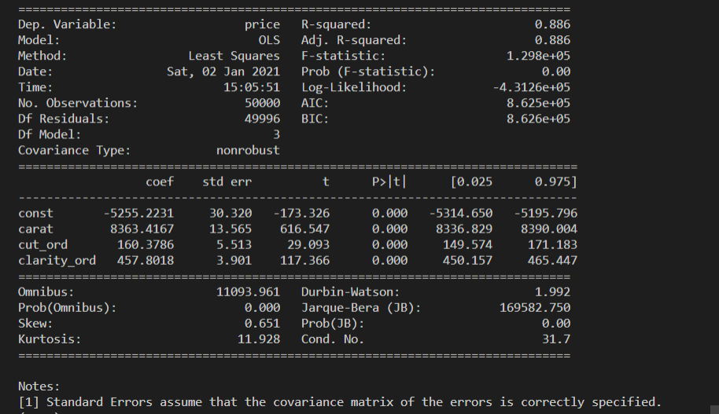

# Building a linear regression model

## Reading and understanding the data

The code below reads the dataset from s3 bucket and converts the byte type to pandas df.

```python
  data = read_file_S3('s3_bucket_name','object_url')
  df = convert_byte_to_df(data)
```


To check if some null values exist in a particular column of your dataset, use function below:

```python
  show_null_rows(df, column_name)
```

To understand your overall data, use function below:

```python
  print_summary(df)
```


## Visualizing the data

To visualize your data, you can use function below:

```python
# For scatterplot
visualize_data(df=df, x_col='x_col_name', y_col='y_col_name', type='scatter')

# For heatmap
visualize_data(df=df,type='heatmap')
```


## Performing Multiple Linear Regression

### Create Train and Test sets

```python
  x_train,x_test = train_df[['carat','cut_ord','clarity_ord']], test_df[['carat','cut_ord','clarity_ord']]
  y_train = train_df['price']
```

### Build and train model

I have used `statsmodel` package here, for linear regression.

```python
  trained_model = train_regression_model(x_train, y_train)
  trained_model.summary()
```



So, the statistics we are mainly concerned with to determine whether the model is viable or not are:

- The coefficients and its p-value(significance)
- R-squared value
- F-statistic and its significance

1. The coefficients for carat, cut_ord, clarity_ord are 8363.4167, 160.3786 and 457.8018 respectively and their corresponding p-value is very low, almost 0. Thus, each of these attributes's cofficients are statistically signicant.

2. R-squared value is 0.886, which means that 88.6% of the Price variance can be explained by the three attributes using this line.

3. Prob (F-statistic) has a very low p-value, practically zero, which gives us that the model fit is statistically significant.

## Prediction and Recommendation

```python
  pred = test_regression_model(x_test, model) # Predict values of target variable
  recommend_bid(pred) # Make recommendation for bidding price
```
