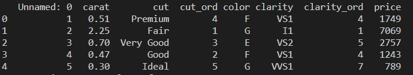
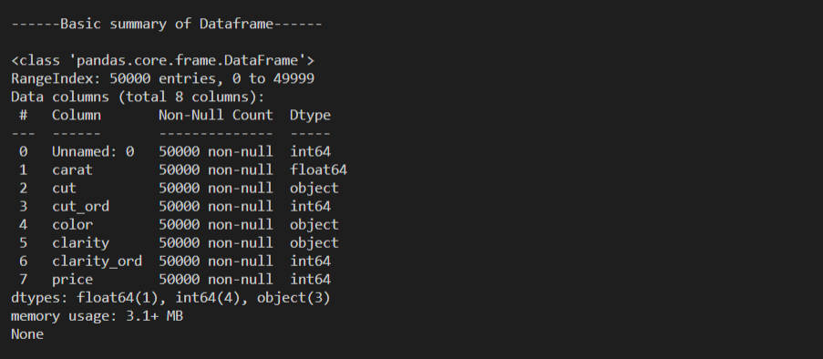
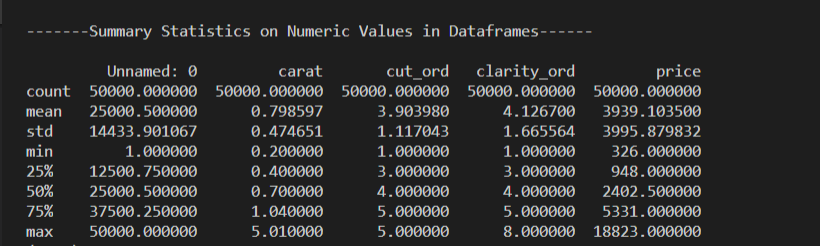
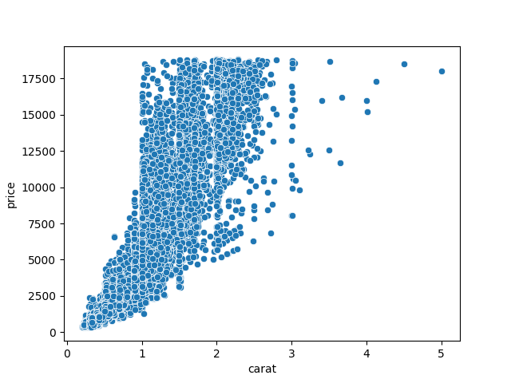
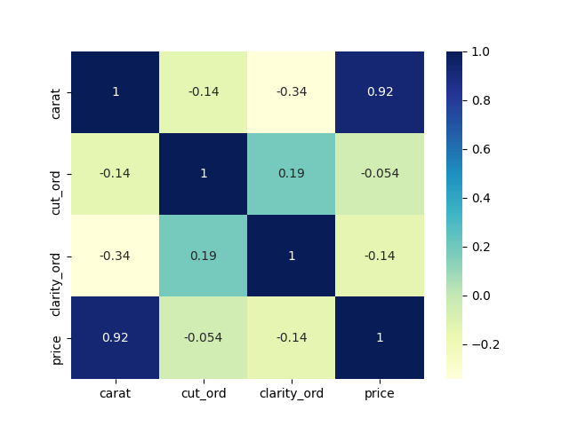

# Building a linear regression model

## Reading and understanding the data

The code below reads the dataset from s3 bucket and converts the byte type to pandas df.

```python
  data = read_file_S3('s3_bucket_name','object_url')
  df = convert_byte_to_df(data)
```



To check if some null values exist in a particular column of your dataset, use function below:

```python
  show_null_rows(df, column_name)
```

To understand your overall data, use function below:

```python
  print_summary(df)
```





## Visualizing the data

To visualize your data, you can use function below:

```python
# For scatterplot
visualize_data(df=df, x_col='x_col_name', y_col='y_col_name', type='scatter')

# For heatmap
visualize_data(df=df,type='heatmap')
```



